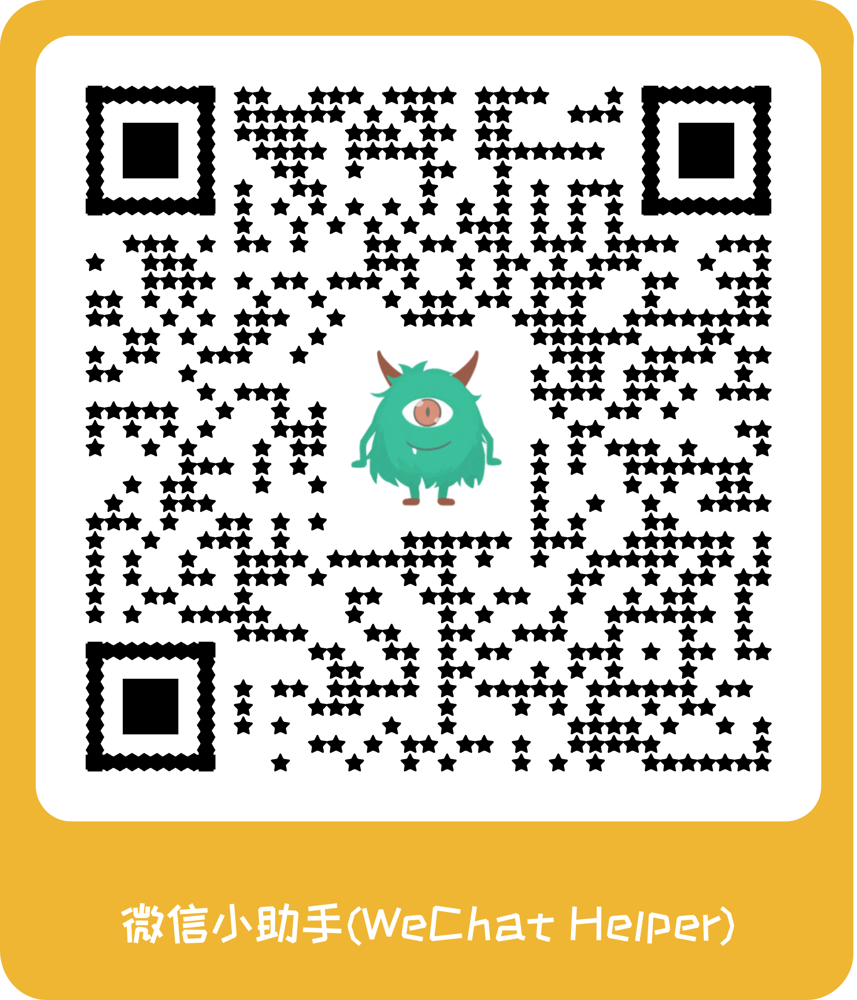
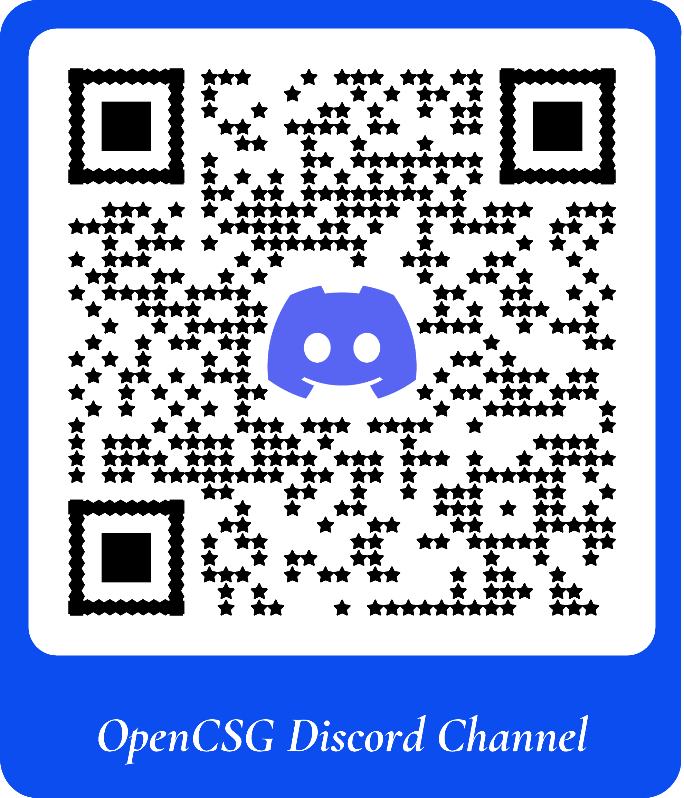
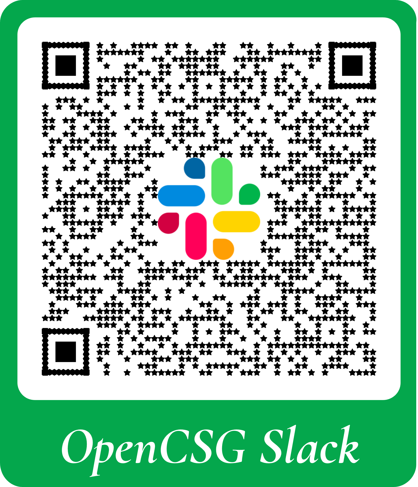

# OpenCSG Community

Welcome to the OpenCSG community!  

Begin your contribution journey here - whether you want to improve code, enhance documentation, or participate in technical discussions.  

- [OpenCSG Community](#opencsg-community)
  - [Introduction](#introduction)
  - [Community Meeting](#community-meeting)
  - [How Can I help ?](#how-can-i-help-)
    - [Become a Contributor](#become-a-contributor)
  - [Questions and Issues](#questions-and-issues)

## Introduction

OpenCSG is an open-source and fair initiative established in 2023, dedicated to building an open community for LLMs.  

OpenCSG stands for Converged resources, Software refined, and Generative LM. The 'C' represents Converged resources, indicating the integration and full utilization of hybrid resources. The 'S' stands for Software refined, signifying software that is refined by large models. The 'G' represents Generative LM, which denotes widespread, inclusive, and democratized generative large models.  

Visit [OpenCSG website](https://opencsg.com/) for in-depth information.  

## Community Meeting

We have public weekly community meetings on Thursdays at 19:00-20:00 (GMT+08:00).

Meeting agendas and notes can be found [here](./meetings).

Meeting recordings are available [here](https://opencsg-china.feishu.cn/drive/folder/GHNafC2melP8k3dxML1c8N7sntc?from=from_copylink) - just click on the date you'd like to view.

## How Can I help ?

Get involved with our community by asking questions, joining discussions, or contributing to OpenCSG's growth.
Built on open-source principles, OpenCSG's large model software stack is available to the community. We encourage everyone to use our tools, share feedback, and collaborate with us.

### Become a Contributor

1. Familiarize youself with the [OpenCSG contributing guide](./guidelines/CONTRIBUTING_en.md).  
2. Begin with the [OpenCSG development guide](https://github.com/OpenCSGs/csghub/blob/main/docs/setup_en.md) for code or documentation contributions.  
3. Join the OpenCSG working group.  

Looking to get your feet wet with OpenCSG? Start by checking out issues labeled "Help Wanted" [here](https://github.com/OpenCSGs/csghub/issues).  

Don't see an issue that interests you? Feel free to explore and test the platform - there's always room for improvement. We also welcome contributions that enhance the documentation with your valuable insights or share your experience through an engaging blog post.  

## Questions and Issues

For support or questions, see the contact information below:  

1. Open an issue in the [primary OpenCSG repository](https://github.com/OpenCSGs/csghub/issues).  
2. Scan the WeChat QR code below to join our WeChat group.  
3. Join our official Discord channel: [OpenCSG Discord Channel](https://discord.gg/bXnu4C9BkR).  
4. Join our Slack workspace: [OpenCSG Slack Channel](https://join.slack.com/t/opencsghq/shared_invite/zt-2fmtem7hs-s_RmMeoOIoF1qzslql2q~A).  

&nbsp;&nbsp;&nbsp;&nbsp;&nbsp;&nbsp;&nbsp;&nbsp;&nbsp;&nbsp;&nbsp;&nbsp;&nbsp;&nbsp;&nbsp;&nbsp;&nbsp;&nbsp;

  &nbsp;&nbsp;&nbsp;&nbsp;&nbsp;&nbsp;&nbsp;&nbsp;&nbsp;&nbsp;&nbsp;&nbsp;&nbsp;&nbsp;&nbsp;&nbsp;&nbsp;&nbsp;

